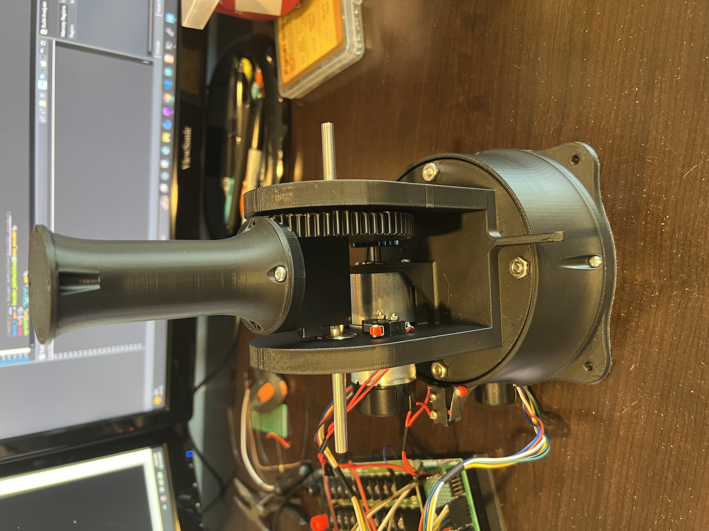
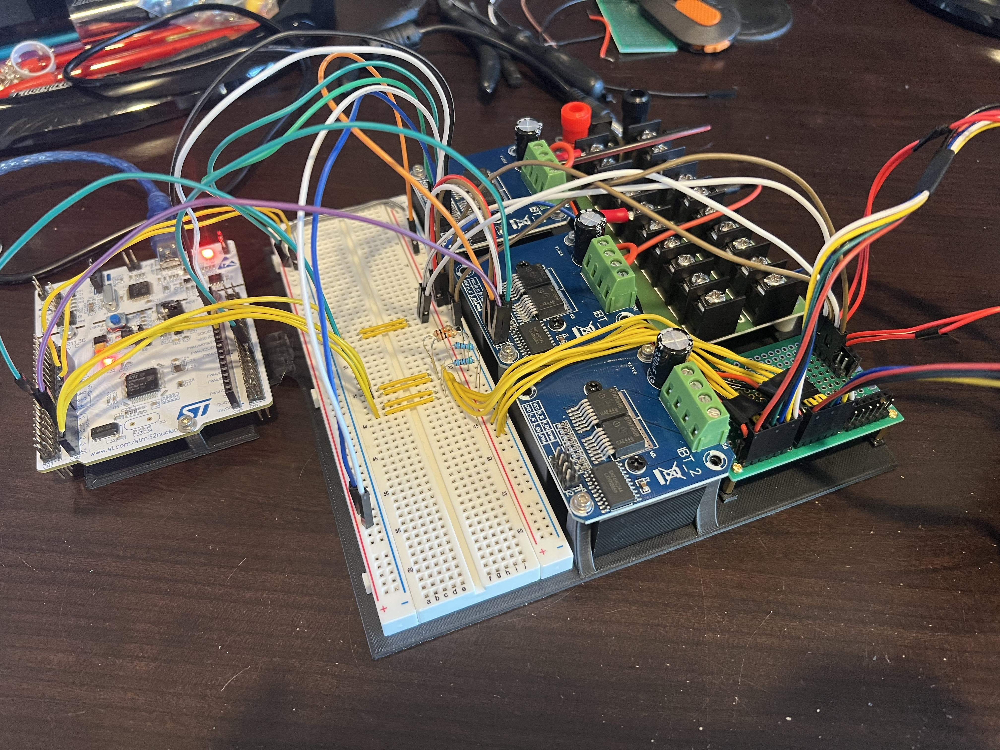
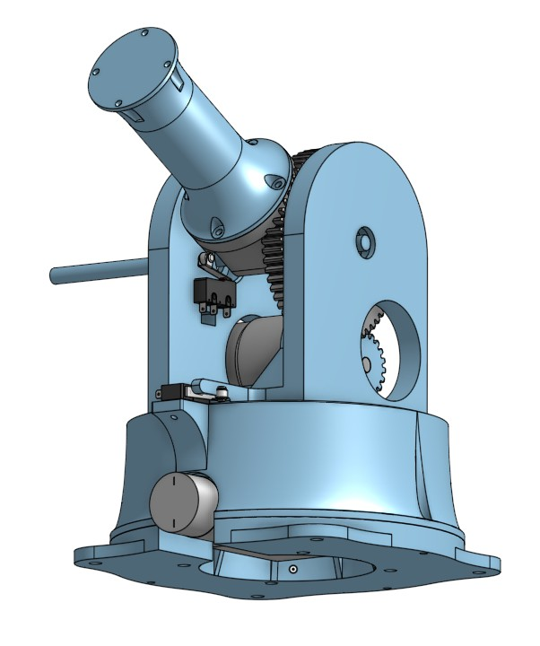
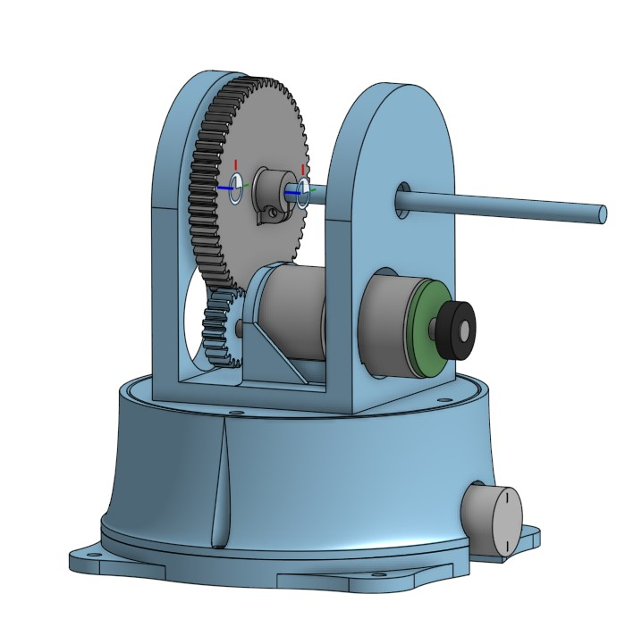
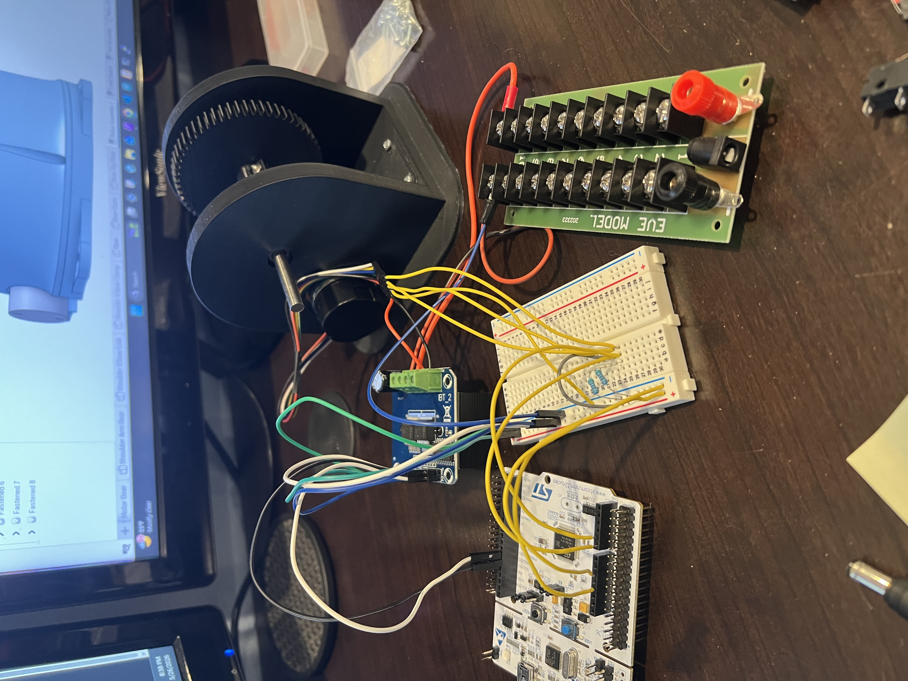

# Robotic Arm Project (Ongoing)

STM32-based robotic arm project focused on embedded control systems and robotic system design. The long-term goal is a 4-5 DOF manipulator with ROS2 integration, computer vision, and AI-assisted task execution using an NVIDIA Jetson Nano. This project is a work in progress and is documented regularly...
<br><br>
Here are some videos demonstrating the current progress:
* [Embedded Communication System & ROS2 Teleoperation (7-7-2026)](https://youtu.be/_pa4kOoXHEc)
* [Base & Shoulder Calibration and Homing (6-14-2026)](https://youtu.be/knIQMhBv_wg)
* [PID Position Control Demo (5-29-2026)](https://youtu.be/YCUa2xMnsVE)

Project Started: May 2026
<br>
Last Documentation Update: 6/14/2026

## Project Goals 

* Design and build a 4 or 5 DOF robotic arm
* Implement real-time control system for precise mechanics
* Enable AI functionality using computer vision on NVIDIA Jetson Nano
* Design custom PCB integrating power systems, embedded processing, and motor driving

## Status 

### Completed
* Shoulder & base joints mechanical prototypes
* Shoulder & base joints PID positional control using STM32
* STM32 embedded firmware architecture
* ROS2 Jetson Nano software architecture
* Shoulder & base joints calibration procedures
* Jetson Nano - STM32 USB serial communication and ROS2 Teleoperation

### In Progress
* ROS2 Teleoperation angular control
* 2-joint forward kimeatics, inverse kinematics 
* Elbow joint mechanical prototype 

### Planned
* 2 then 3-DOF mechanics and control, ultimately expand to 4 or 5 DOF
* NVIDIA Jetson Nano + STM32 distributed system for high-level planning and real-time control
* RTOS implementation 
* ROS2 package for high-level robot interfacing
* AI and computer vision integration

## How it Works 

### Mechanical Design
---
<div>
   
  <p>The mechanical structure is being developed using OnShape. The current prototype shows basic shoulder joint and rotating base design. The design distributes mechanical loads through dedicated bearings rather than motor shafts and maximizes torque closer to the shoulder joint. The new design improves stiffness and reduces footprint from the previous version. The design builds in limit switches for joint position calibration. <br><br> Next steps: elbow joint design</p>
  <br clear="right" />
</div>

### Embedded Architecture 
---
<div>
   
  
  <p>The robotic arm is powered by an STM32 Nucleo-F446RE, responsible for all of the real-time control code. Motors are driven by IBT-2 type motor driver modules rated for up to 43A. <br> <br> The plan is to flesh out communication between the STM32 and an NVIDIA Jetson Nano which will handle higher level computation using ROS2. <br><br> Next steps: Jetson-STM serial communication, basic control inputs using ROS2</p>
  <br clear="right" />
</div>


### Control
---
The shoulder and base joints currently uses a 1kHz closed-loop PID controller running on an STM32F446RE. Joint position is determined using an encoder updated every control loop cycle. The motors are driven using IBT-2 type motor driver modules. Each joint has a calibration procedure using limit switches. <br><br> Next steps: basic angular control of each joint, 2-joint forward kinematics, 2-joint inverse kinematics. 

[Embedded Communication System & ROS2 Teleoperation (7-7-2026)](https://youtu.be/_pa4kOoXHEc)
[Base & Shoulder Calibration and Homing (6-14-2026)](https://youtu.be/knIQMhBv_wg)

## Technical Stack

### Hardware
* STM32 Nucleo F446RE
* NVIDIA Jetson Nano (planned)
* IBT-2 Motor Driver Modules
* Geared DC Motors with Encoders
### Software
* C (STM32)
* FreeRTOS (planned)
* ROS2 (planned)
### Design Tools 
* OnShape (CAD)
* STM32CubeMX & STM32CubeIDE
* Git

## Repository Structure 
````text
robotic-arm/
├── communication/
├── firmware/ 
│   └── arm_stm32/
├── hardware/
│   ├──  CAD/
│   └──  KiCAD/
├── media/
├── software/
│   └── arm_ros2_ws/
└── README.md
````

## Code Structure
* `communication/` - Defines and builds serial communication protocol
* `firmware/arm_stm32/` - STM32 project main folder
  * `firmware/arm_stm32/Core/Src/` - Source files for STM32 real-time embedded control
  * `firmware/arm_stm32/Core/Inc/` - Header files for embedded code
* `software/arm_ros2_ws/` - ROS2 workspace
  * `software/arm_ros2_ws/src/arm_bringup/` - ROS2 launch files
  * `software/arm_ros2_ws/src/arm_interfaces/` - ROS2 custom services source code
  * `software/arm_ros2_ws/src/arm_teleop/` - ROS2 teleoperation nodes
  * `software/arm_ros2_ws/src/stm32_bridge/` - Jetson Nano & STM32 serial communication package


## Media 

[Embedded Communication System & ROS2 Teleoperation (7-7-2026)](https://youtu.be/_pa4kOoXHEc) <br>
[Base & Shoulder Calibration and Homing (6-14-2026)](https://youtu.be/knIQMhBv_wg) <br>
[PID Position Control Demo (5-28-2026)](https://youtu.be/YCUa2xMnsVE)

<div align="left">
  
  
  
  <br clear="left" />
  
  
</div>


